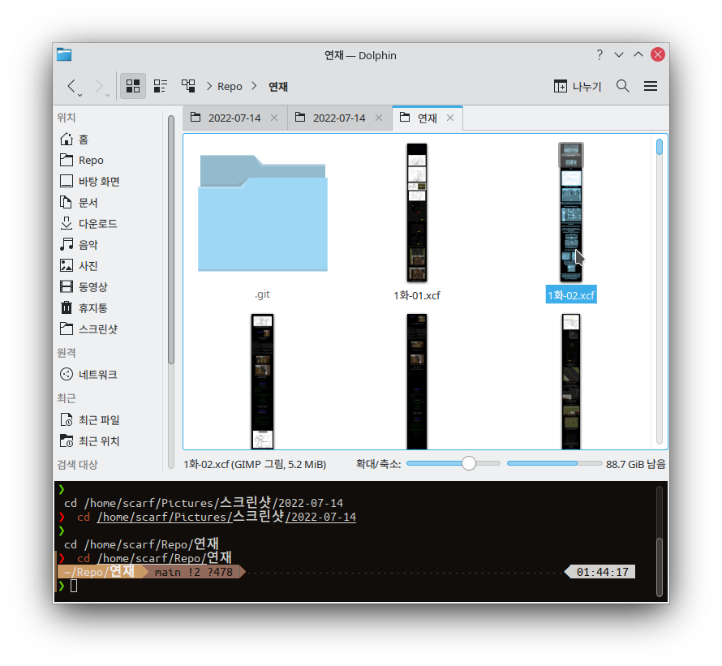
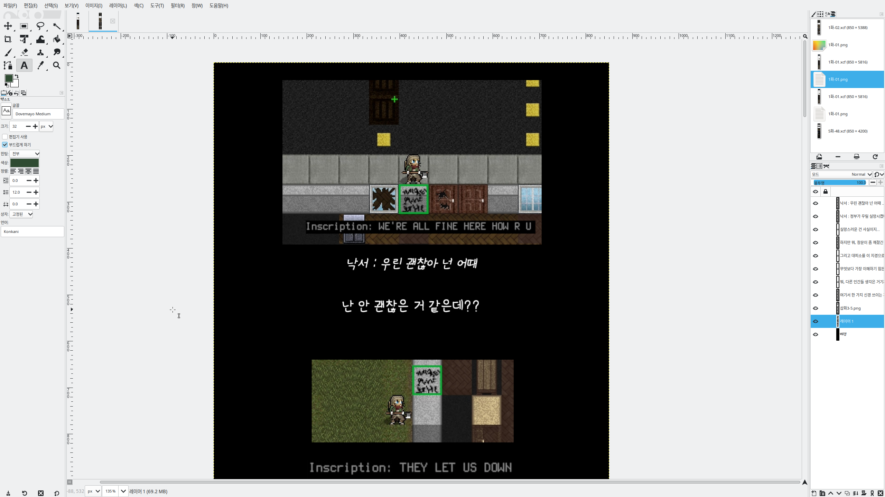
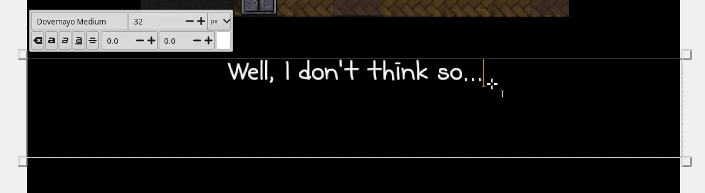
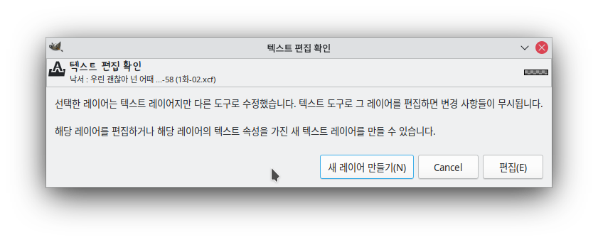
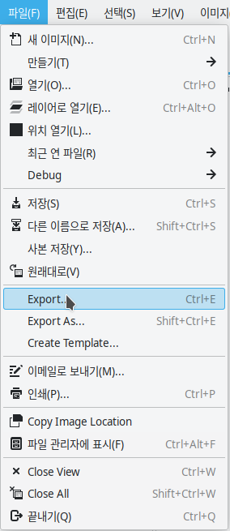
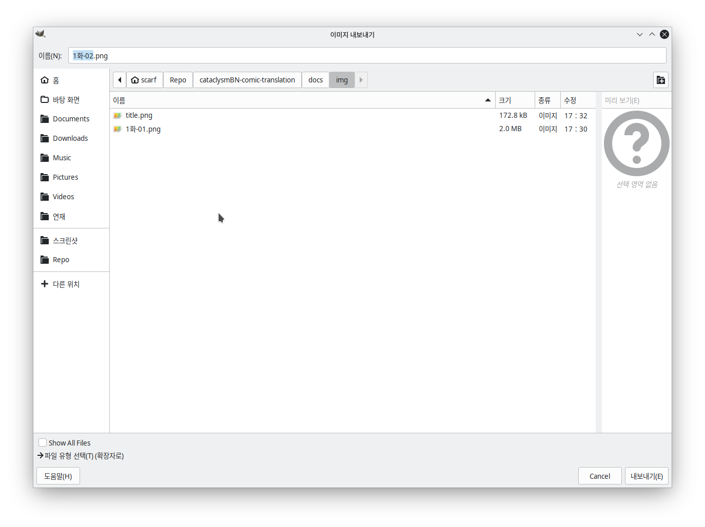
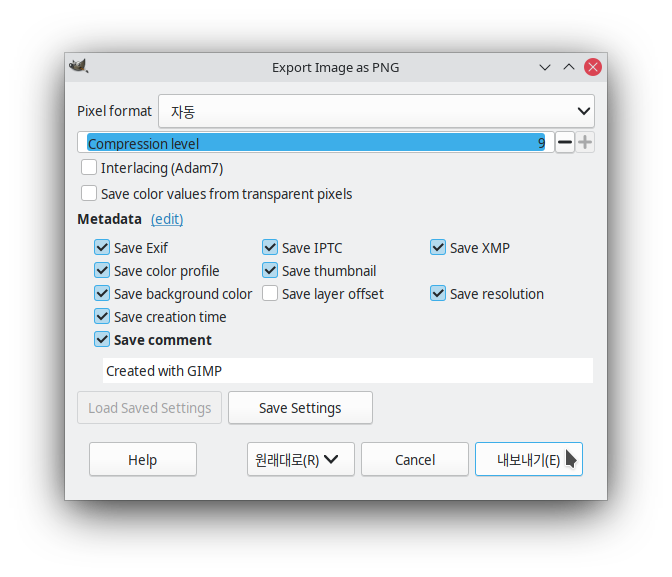

# 사진 식질하는법

## 참고사항

- 원본 `xcf` 파일이 있어서 텍스트 레이어에서 글만 수정하면 됨
- 게임 화면은 가급적이면 및에 영어 주석을 달거나 텍스트가 중요할 경우 언어를 영어로 바꿔 스크린샷을 새로 찍는 게 나을 수 있음
- 번역 스프레드시트는 확정된 번역이 아님, 그래도 확실한 것 같다면 마음대로 해도 OK
- TODO: 확정 번역 시트 추가하기

## 준비물

- [원본 xcf 파일 (대략 3GB)](index.md#원본-xcf-파일)
- [둘기마요 폰트](https://m.blog.naver.com/oters/221300837221)
- [GIMP 채신판](https://www.gimp.org)
  - 설치법은 대충 [위키하우](https://ko.wikihow.com/김프-설치하는-법)같은곳에있음
- [번역 스프레드시트](index.md#번역-스프레드시트)

## 과정

다운받은 폴더를 열면 대충 이렇게 여러 `xcf` 파일들이 있는데

번역할 파일을 김프로 열면 이런 화면이 반겨줌

텍스트 레이어를 클릭한다음 번역하면 됨

이런 확인 메시지가 자주 뜰 텐데 안 보이게 하는법은 몰?루
무시하려면 `편집(E)` 누르면 되는데 단축키는 `Alt + E`

다 마치면 `Export`를 눌러서 `png` 파일로 내보내기

바로 확인 누르면댐

## 마크다운에서 보는법
- `docs/img/` 디렉토리에 이미지를 넣고
- `../img/1화-01.png)` 같은 식으로 넣어주면 됨
- TODO: 마크다운 생성 자동화하기

## 웹사이트 클라이언트 실행해서 보는법

준비물: 파이썬 `3.10` 이상, 의존성 패키지들

- `python3 -m venv .venv` (UNIX)나 `py -m venv .venv` 명령어 (Windows)로 가상환경 생성
- `source .venv/bin/activate` (UNIX)나 `.venv\Scripts\activate` (Windows)로 가상환경 실행
- `pip install -r requirements.txt` 명령어로 의존성 패키지들 설치

`mkdocs serve` 명령어로 테스트 서버 실행

- `http://127.0.0.1:8000`에서 보면 됨

## 만든 사진은 어디로?

- PR로 올리거나 깃허브 계정이 없으면 이메일로 보내주심 됨
- 이메일 주소: `greenscarf005@gmail.com`
